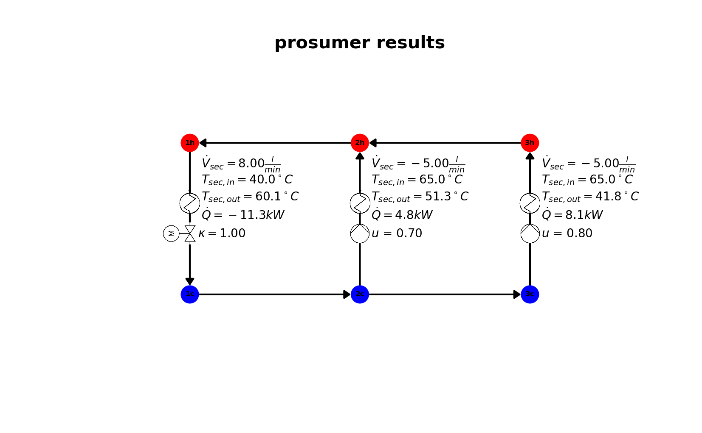

# ProHeatNet_Sim
A python based simulation framework for the thermohydraulic simulation of prosumer-dominated heat networks.
The model on which this simulation framework is built on is described in the Paper "Thermohydraulic Model of Smart Thermal Grids with Bidirectional Power Flow between Prosumers". A preprint is submitted to Energy - The International Journal by Elsevier and under revision. The preprint can be found on researchgate: https://doi.org/10.13140/RG.2.2.16914.68803

# How to run the example
- Download / clone the latest release.
- Make sure your system meets the requirements (see below):
  - python 3.7 or higher installed
  - Gurobi optimizer version 9.0.1 or higher installed
  - suitable license for Gurobi
  - module "gurobipy" installed
  - IPython (Interactive Python) version 7.12.0 or higher installed
- open command shell of your operating system
- start ipython
  ```
  ipython
  ```
- navigate to the directory that you downloaded the repository to
  ```
  cd *your_directory*
  ```
- do some settings to automatically reload changes in the python code files
  ```
  %load_ext autoreload
  %autoreload 2
  ```
- run the main file
  ```
  run A_main.py
  ```
- the example setup in directory *./setup/example* will be used
- calculation starts
- results show in command window
- figures with visualizations of the results should show
- results are saved in the *results* folder printed to textfile *results.txt* and saved as a python pickle in *results.pkl*, also an Excel-Spreadsheet is created *example_202XXXXX_XXXXXX.xlsx*
- results should be the same as in folder *./example_results*

# How to modify the setup
- go to directory *./setup/example* and copy the three files
- paste the copied files in folder *./setup/my_setup*
- modify the setup by modifying the pasted files *configuration.py*, *parametrization.py* and *scenario.py*
- modify the paths at the top of *A_main.py*
  ```
  path_config     =   "set-up/my_setup/configuration.py"
  path_param      =   "set-up/my_setup/parametrization.py" 
  path_scenario   =   "set-up/my_setup/scenario.py"
  ```
- run the main file by command shell
  ```
  run A_main.py
  ```
## Examplary result plots



# Requirements
The code was tested under Linux and under Windows with the following specifications.
## Linux
- Operating system: Ubuntu 18.04.5 LTS
- Python version: Python 3.7.6
- Optimizer: Gurobi Optimizer version 9.0.1 build v9.0.1rc0 (linux64), Academic license - for non-commercial use only
- install module "gurobipy" (https://www.gurobi.com/documentation/9.0/quickstart_mac/the_grb_python_interface_f.html)
- IDE: none, instead: IPython (Interactive Python) version 7.12.0
## Windows
- operating system: Microsoft Windows Version 10.0.18363.1139
- Python version: Python 3.8.3
- Optimizer: Gurobi Optimizer version 9.1.0 build v9.1.0rc0 (win64)
- install module "gurobiypy" (https://www.gurobi.com/documentation/9.0/quickstart_mac/the_grb_python_interface_f.html)
- - IDE: none, instead: IPython (Interactive Python) version 7.16.1
